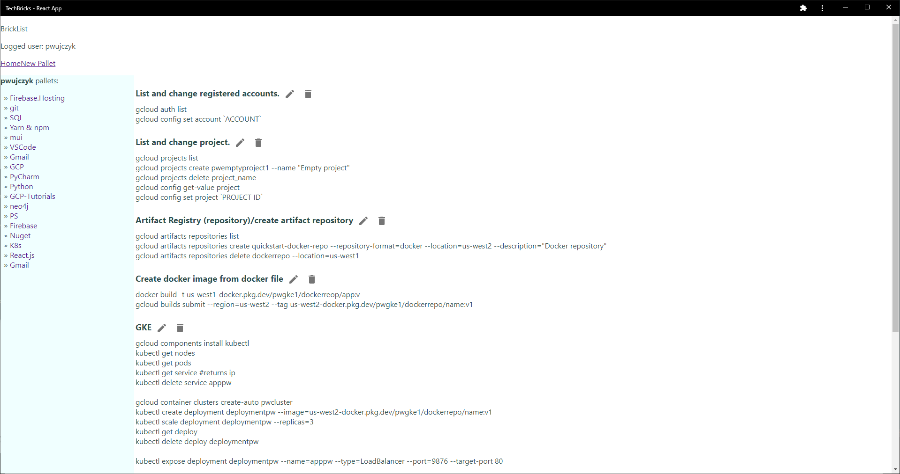
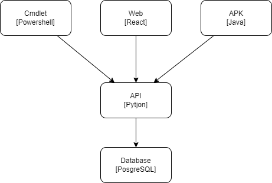
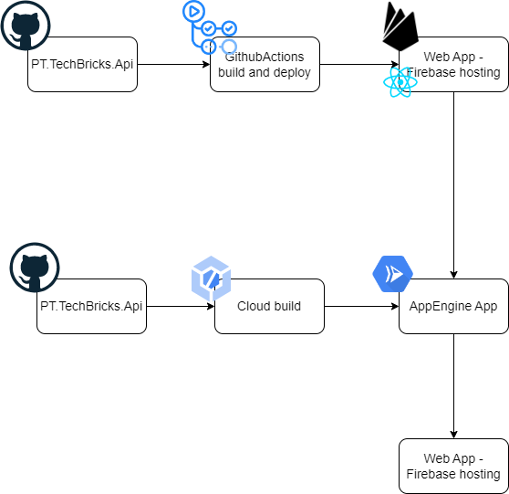

Working with tech stuff you need to remember a lot of things
- Shortcuts in IDE
- Commands in console
- Git commands
- Specific snippets

If you are coding in multiple languages the list grows rapidly.

The application allows to gather the most common information in one place 

## HL architecture 

## Physical and CI CD

